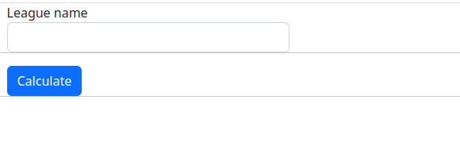
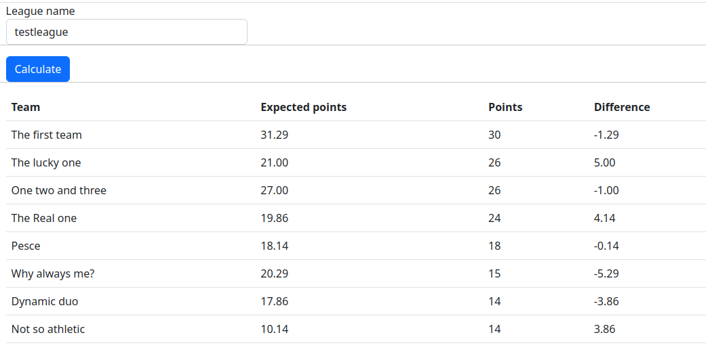

# fantalegheEV-ui
This is a basic UI for the fantalegheEV project. Refer to this [fantalegheEV-api](https://github.com/antpas14/fantalegheEV-api) for more information.

### Sites screenshots
UI is quite basic and just requires the league name to be passed through the form

Then click on the calculate button

After calculation is made, rank will appear on bottom. It contains:
* points calculated by the algorithm
* actual point earned by the team
* difference between them

A *positive* difference gives an estimate on how the team has been *lucky* until now. Otherwise, a *negative* difference gives an estimate on how the team has been *unlucky*.

### License

This work is distributed under MIT license.